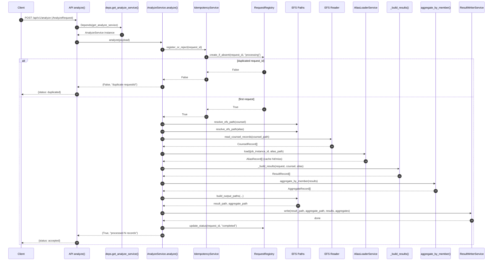
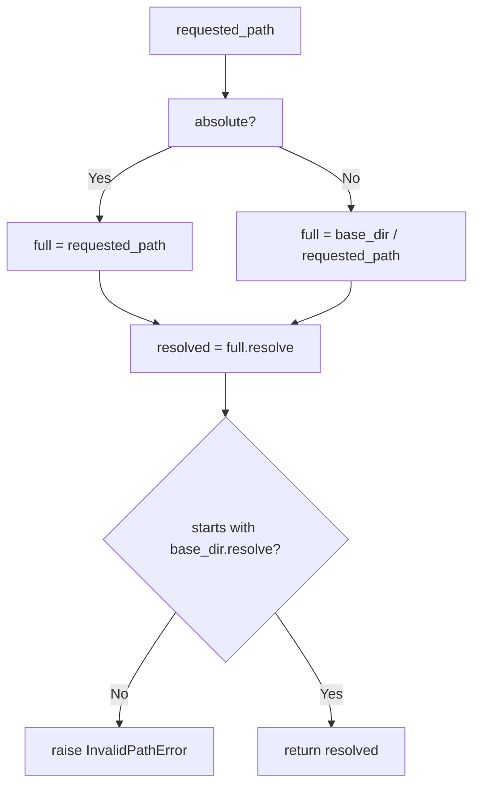
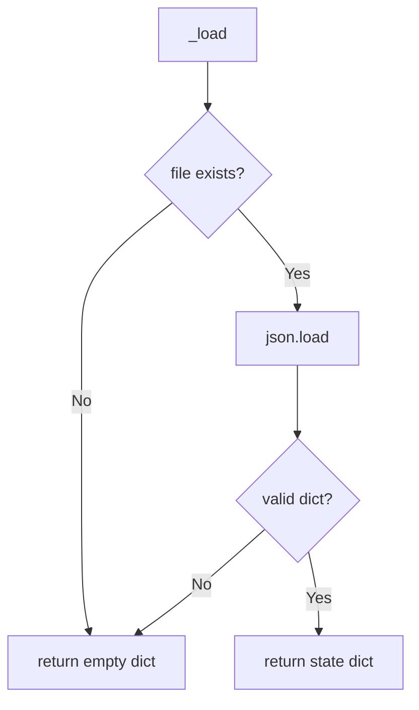
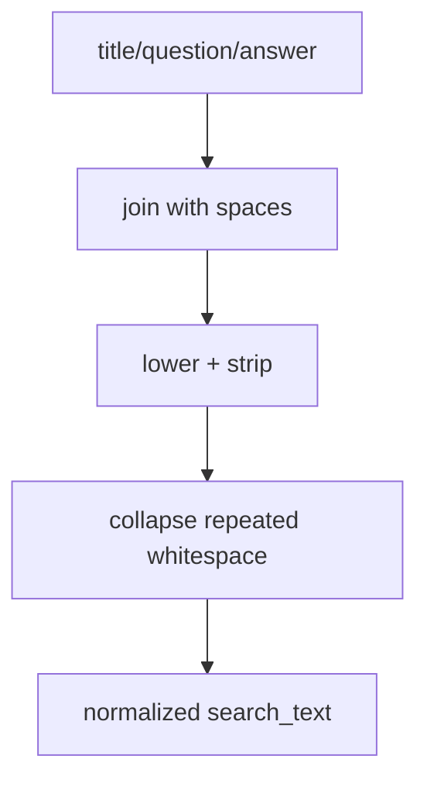

# Counseling Analytics Flow Diagrams

이 문서는 현재 코드 기준의 API/서비스/인프라 플로우를 메서드 단위로 설명합니다.

## 1) End-to-End: `POST /api/v1/analyze`



### 실패 시 예외 플로우

```mermaid
flowchart TD
    A[AnalyzeService.analyze()] --> B{Any exception?}
    B -- No --> C[update_status completed]
    C --> D[Return accepted]

    B -- Yes --> E[update_status failed]
    E --> F[raise exception]
    F --> G[API analyze catches]
    G --> H[HTTP 500 반환]
```

## 2) API Layer

### `app/main.py`

```mermaid
flowchart TD
    A[App startup] --> B[get_settings]
    B --> C[configure_logging]
    C --> D[FastAPI(title=settings.app_name)]
    D --> E[include public health router]
    E --> F[include api_router with prefix /api/v1]
```

### `analyze()`

```mermaid
flowchart TD
    A[POST /api/v1/analyze] --> B[Pydantic AnalyzeRequest validation]
    B --> C[service.analyze(payload)]
    C --> D{Exception?}
    D -- Yes --> E[HTTP 500]
    D -- No --> F{accepted?}
    F -- No --> G[AnalyzeResponse duplicated]
    F -- Yes --> H[AnalyzeResponse accepted]
```

### `get_request_state()`

```mermaid
flowchart TD
    A[GET /api/v1/ops/requests/{request_id}] --> B[registry.get(request_id)]
    B --> C{state exists?}
    C -- No --> D[404 request not found]
    C -- Yes --> E[return requestId + status]
```

## 3) Service Layer

### `AnalyzeService.analyze()`

```mermaid
flowchart TD
    A[analyze(request)] --> B[idempotency.register_or_reject]
    B --> C{accepted?}
    C -- No --> D[return duplicated]

    C -- Yes --> E[resolve counsel/alias path]
    E --> F[read_counsel_records]
    F --> G[alias_loader.load]
    G --> H[_build_results]
    H --> I[aggregate_by_member]
    I --> J[build_output_paths]
    J --> K[result_writer.write]
    K --> L[registry.update_status completed]
    L --> M[return accepted]
```

### `_build_results()`

```mermaid
flowchart TD
    A[AliasRecord[]] --> B[flatten aliases -> alias_entries]
    C[CounselRecord[]] --> D[loop each counsel]
    B --> D
    D --> E[extract_search_text]
    E --> F[loop each alias_entry]
    F --> G[contains_match]
    G --> H{matched?}
    H -- Yes --> I[append MatchedKeywordRecord]
    H -- No --> F
    I --> F
    F --> J[build ResultRecord for counsel]
    J --> K[append to results]
    K --> D
    D --> L[return ResultRecord[]]
```

### `AliasLoaderService.load()`

```mermaid
flowchart TD
    A[load(cache_key, path)] --> B[cache.get(cache_key)]
    B --> C{cache hit?}
    C -- Yes --> D[return cached AliasRecord[]]
    C -- No --> E[read_alias_records(path)]
    E --> F[cache.set(cache_key, rows)]
    F --> G[return rows]
```

### `IdempotencyService.register_or_reject()`

```mermaid
flowchart TD
    A[register_or_reject(request_id)] --> B[acquire process_lock]
    B --> C[registry.create_if_absent(request_id, processing)]
    C --> D[release process_lock]
    D --> E[return bool]
```

### `ResultWriterService.write()`

```mermaid
flowchart TD
    A[write(result_path, aggregate_path, ...)] --> B[write_result_records]
    B --> C[write_aggregate_records]
    C --> D[done]
```

## 4) Infra Layer

### `resolve_efs_path()`



### `read_jsonl()`

```mermaid
flowchart TD
    A[open file] --> B[read line by line]
    B --> C{blank line?}
    C -- Yes --> B
    C -- No --> D[json.loads(line)]
    D --> E{json valid?}
    E -- No --> F[raise ValueError with line_no]
    E -- Yes --> G[yield dict]
    G --> B
```

### `write_jsonl()`

```mermaid
flowchart TD
    A[write_jsonl(path, rows)] --> B[mkdir parent]
    B --> C[open tmp file]
    C --> D[write each row as JSONL]
    D --> E[tmp.replace(path)]
    E --> F[atomic save complete]
```

### `RequestRegistry`



```mermaid
flowchart TD
    A[create_if_absent(request_id,status)] --> B[_load]
    B --> C{request exists?}
    C -- Yes --> D[return False]
    C -- No --> E[insert request status]
    E --> F[_save tmp->replace]
    F --> G[return True]
```

```mermaid
flowchart TD
    A[update_status(request_id,status)] --> B[_load]
    B --> C[get or create item]
    C --> D[item.status = status]
    D --> E[_save tmp->replace]
```

## 5) Pipeline Layer

### `extract_search_text()` + `normalize_text()`



### `contains_match()` + `score_match()`

```mermaid
flowchart TD
    A[search_text, alias_norm] --> B{alias_norm in search_text?}
    B -- No --> C[return None]
    B -- Yes --> D[ratio = len(alias)/len(source)]
    D --> E[clamp score to 0.5~1.0]
    E --> F[return rounded score]
```

### `aggregate_by_member()`

```mermaid
flowchart TD
    A[ResultRecord[]] --> B[for each result]
    B --> C[for each matched keyword]
    C --> D[key=(request,job,member,keyword)]
    D --> E[bucket.count += 1]
    E --> F[bucket.case_ids add case_id]
    F --> C
    C --> G[convert buckets -> AggregateRecord[]]
    G --> H[sort caseIds]
    H --> I[return aggregates]
```

## 6) 실제 요청 한 건 기준 읽는 순서 (추천)

1. `API analyze()`에서 요청 검증 + service 호출
2. `AnalyzeService.analyze()`에서 큰 흐름 파악
3. `idempotency`/`registry`로 중복 처리 방식 확인
4. `efs/reader` + `schemas`로 입력 포맷 확인
5. `_build_results()` + `pipeline/*`로 매칭 로직 확인
6. `aggregator` + `efs/writer`로 출력 포맷/저장 확인
7. `ops` API로 상태 조회 방식 확인
